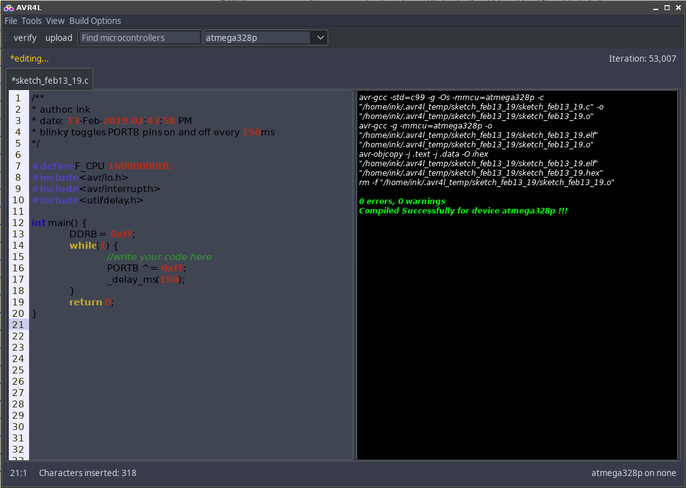

# Better AVR
A fork of [AVR4L](https://github.com/abdalmoniem/AVR4L) which aims to be a bit more buildable, and with UI 
tweaks.

## About:
AVR4L aims to deliver an easy to use and user friendly Integrated Development Environment for developing Codes for microcontrollers based on Atmel's AVR families. AVR4L is a Creative coding / Integrated Development Environment for Linux operating systems intended for AVR beginners as well as professionals, it has many features from professional IDEs as well as the simplicity of editing.

## Installation and Running:
TODO: rewrite this system to use GRADLE
